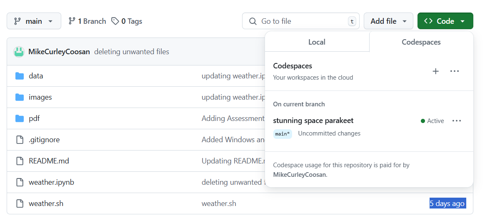

# Computer Infrastructure

**by Michael Curley (G00376456@atu.ie)**


<div>
<a target="_blank" href="https://docs.python.org/3/tutorial/index.html">
   </a>
<a target="_blank" href="https://www.anaconda.com/">
  
</a>
<a target="_blank" href="https://numpy.org/devdocs/index.html">
  
</a>
<a target="_blank" href="https://pypi.org/project/pandas/">
  
</a>
<a target="_blank" href="https://matplotlib.org/">
  
</a>
<a target="_blank" href="https://docs.github.com/en/get-started/writing-on-github/
getting-started-with-writing-and-formatting-on-github/basic-writing-and-formatting-syntax">
  
</a>
<a target="_blank" href="https://www.latex-project.org/">
  
</a>
<a target="_blank" href="https://code.visualstudio.com/">
  
</a>
<a target="_blank" href="https://jupyter.org/">
  
</a>
</div>

-----

_This README has being written with [GitHub's Documentation on README's](https://docs.github.com/en/repositories/
managing-your-repositorys-settings-and-features/customizing-your-repository/about-readmes) in mind. You should 
refer to that documentation for more information on writing an appropriate README for visitors to your 
repository._

_You can find out more about writing in MarkDown in [GitHub Documentation](https://docs.github.com/en/get-started/
writing-on-github/getting-started-with-writing-and-formatting-on-github/basic-writing-and-formatting-syntax)_

---

## Table of Contents.

* [1.0 About this project](#10-about-this-project)
* [2.0 Use of this project](#20-use-of-this-project)
  * [2.1 Getting Started](#22-getting-started)
* [3.0 Get Started](#30-get-started)
  * [3.1 To get started follow these instructions](#31-to-get-stated-with-this-project-please-follow-these-steps)
  * [3.2 Using GitHub codespaces](#32-using-github-codespaces-to-complete-the-tasks)
* [4.0 Get Help](#40-get-help)
  * [4.1 Issue Tracker](#41-issue-tracker)
  * [4.2 Contact Us](#42-contact-us)
* [Contribute](#50-contribute)
* [Author](#60-author)
----
## ***1.0 About this project***
----


This repository contains the assessment tasks and project for the Computer Infrastructure module as part of the Higher Diploma in Data Analytics, at the Atlantic Technological University (ATU) Galway. 

----
## ***2.0 Use of this project***
----


The purpose of the project is to demonstrate an ability to complete the following tasks:

1. Use, configure, and script in a command line interface environment.

2. Manipulate and move data and code using the command line.

3. Compare commonly available software infrastructures and architectures.

4. Select appropriate infrastructure for a given computational task.


### 2.1 Getting Started

To start using this project, simply follow the steps outlined in the [Get Started](#30-get-started) section below. Once you have set up the project, you can begin exploring and analyzing the data in this project right away.

----
## 3.0 Get Started
----

### 3.1 To get stated with this project please follow these steps:

1. Clone the repository to your local machine. 

```sh
git clone https://github.com/MikeCurleyCoosan/computer_infrastructure.git

```
2. Download and install [Anaconda](https://www.anaconda.com/). Anaconda comes with its own set of pre-installed 
data science packages and tools, making it convenient for beginners to set up their environment quickly. The 
pre-installed packages that are required to work with the project are [Pandas](https://pandas.pydata.org/), 
[NumPy](https://numpy.org/) [Matplotlib](https://matplotlib.org/) and [Seaborn](https://seaborn.pydata.org/index.
html).

3. Download and install [Visual Studio Code](https://code.visualstudio.com/). Visual Studio Code is a code editor 
with support for development operations like debugging, task running, and version control.

4. Download and install the latest version of [Git](https://git-scm.com/). Git is a free and open source version 
control system designed to handle everything from small to very large projects with speed and efficiency.

5. Navigate to the project directory in VS Code.

6. Use the weather.ipynb notebook to follow along with the various tasks undertaken during the course of the project. These tasks are using the command line. You may complete these tasks on the command line of the Visual Studio Code distribution you have downloaded above, or you may use GitHub codespaces to complete the tasks. Instructions on using GitHub codespaces are given below if you would rather use this option, which will enable you to complete the tasks without following the steps 1-5 above.


### 3.2 Using GitHub Codespaces to complete the tasks:

1. Create a GitHub account if you don't already have one. You may create a GitHub accound by following the link given [here](https://github.com). 

2. Create a new repository called 'Computer_Infrastructure' in your GitHub account. 

3. Navigate to your new repository. 

4. In your repository click on the green `<> Code` button as shown in the image below.



5. Click the Codespaces button at the top of the new window that pops up when you click the green button above.

6. Click create codespace if its your first time using codespace in this repository, otherwise click on your existing codespace.


----
## 4.0 Get Help
----

If you encounter any issues or have questions about the project, there are a couple of resources available to 
help you:

### 4.1 Issue Tracker

Visit our [issue tracker](https://github.com/MikeCurleyCoosan/computer_infrastructure/issues) on GitHub to see if your problem has already been reported or to report a new issue. Feel free to join any ongoing discussions related to bugs or feature requests.

### 4.2 Contact Us

If you need further assistance or have any other inquiries, you can reach out to me via [email](G00376456@gatu.
ie). I will do my best to respond to your enquiry in a timely manner.
Please don't hesitate to reach out if you need help or have feedback on how the project may be improved.

----
## 5.0 Contribute 
----

Contributions from the community to help improve the project are welcome. Whether you're a developer, data 
scientist, or command line enthusiast, there are several ways you can contribute:

### 5.1 Feature Requests

Have an idea for a new feature or enhancement? Feel free to [open a feature request](https://github.com/MikeCurleyCoosan/computer_infrastructure/issues) on our GitHub repository. I value your feedback and are always looking for ways to enhance the project.

### 5.2 Code Contributions

If you're interested in contributing code, I would love to have your help! You can [open a pull request](https://github.com/MikeCurleyCoosan/computer_infrastructure/pulls) on our GitHub repository, which I will endevour to respond to in a timely manner.

----
## 6.0 Author
----

### About Me: 

My name is Michael Curley and I am a student in the Higher Diploma in Data Analytics Course in ATU, Galway 
Ireland. This project was undertaken as part of the Computer Infrastructure Module undertaken as part of 
that course of study.


